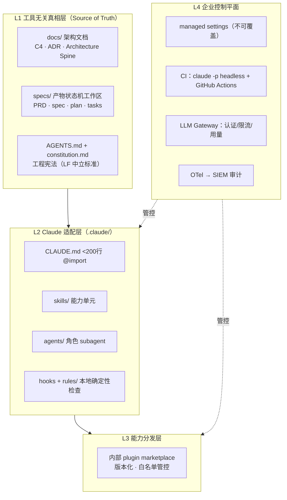

# 基于 Claude Code 的企业级端到端（E2E）软件研发平台：现有项目调研与设计建议

> 调研日期：2026-07-30 · 方法：四路异构搜索（2×Claude + GPT 族 + Gemini 族）+ 定向补搜核实 + 异构终审辩论 · 总体置信度：**高**（30+ 独立来源，关键结论均 ≥2 独立域名交叉证实）
> **v2**（2026-07-30）：并入配套调研《[企业级软件开发端到端阶段划分-完整报告](企业级软件开发端到端阶段划分-完整报告.md)》——流程设计升级为"6 段治理底图 × 产物状态机"两视图，状态机补齐立项前发现与退役两端，门禁密度按风险配置，验证税实证进设计依据
> **v2.1 命名更正**：范围已覆盖战略/立项→退役全程，超出口语中 "SDLC" 的惯常含义（教科书 SDLC 恰不含两端；ISO 12207 广义"软件生命周期"虽含两端，但易误读），故平台与产物命名由 SDLC 更正为 **E2E（端到端）**；正文中保留 "SDLC" 一词之处均指其经典狭义用法或原始研究问题表述

## TL;DR（执行摘要）

1. **没有任何单一开源方案覆盖企业完整 SDLC**——spec-kit、BMAD、OpenSpec、ccpm 都强于"需求→开发"，发布、运维、审计必须由企业控制平面补齐（三方独立得出同一结论）。
2. 正确做法是**四层平台架构**：工具无关真相层（docs/specs/AGENTS.md）→ Claude 适配层（.claude/）→ 能力分发层（内部 plugin marketplace）→ 企业控制平面（managed settings / CI / 审计 / 网关）。
3. **流程分两个视图**：外层治理视图用 6 段端到端底图（战略/立项 → 产品发现 → 定义/设计 → 构建与交付 → 运营/演进 → 退役，配套调研四路独立收敛的骨架）；内层执行视图由"产物状态机"驱动，不由对话驱动：PR-FAQ → PRD → spec → plan/ADR → tasks → code+tests → PR → release → runbook → 退役，在立项、需求确认、架构评审、合并、生产放行、退役六处设人审门禁——**门禁密度按风险与合规强度配置、由证据触发而非日期**；hooks 做本地确定性检查、服务端 CI/受保护分支做不可绕过门禁。
4. 2026-07 的组件边界：**commands 已并入 skills**（旧目录兼容、新项目一律用 `.claude/skills/`）；Agent Teams（`CLAUDE_CODE_EXPERIMENTAL_AGENT_TEAMS=1`）与 Dynamic Workflows 仍是实验特性，**不要进平台核心**。
5. 落地路径：以 **spec-kit 的产物链与人审门禁**为骨架借鉴（不必整套照搬），目录自建（本报告给出完整目录树），用官方 plugin marketplace 机制做团队分发，Spotify/Intercom/Anthropic 的一手实践提供发布与治理段的参照。

## 研究问题

在企业环境下，基于 Claude Code / Claude Agent SDK 生态搭建覆盖完整 SDLC（需求→设计→开发→测试→发布→运维）的软件开发平台：现有开源项目与社区实践如何组织目录结构与文件内容，如何编排流程（阶段门禁、人审介入、产物流转），架构文档与流程文档如何设计？

## 评估维度

等权五维（1-5 分，✓ = 该维度最优，? = 数据不足不填空分）：

1. **SDLC 覆盖完整度**——覆盖需求/设计/开发/测试/发布/运维全流程，还是仅部分环节
2. **企业级成熟度**——治理、权限、审计、质量门禁、团队分发、CI 集成
3. **目录结构组织**——结构清晰度、可维护性、可移植性
4. **流程编排机制**——阶段门禁、人机协作点、产物流转设计
5. **社区活跃度与可持续性**——真实采用、release 频率、维护状态

## 生态全景：别人是怎么做的

### 官方原语与组件边界（2026-07 现状）

Claude Code 官方提供的平台积木（[best-practices](https://code.claude.com/docs/en/best-practices)、[plugins](https://code.claude.com/docs/en/plugins)）：

| 组件 | 定位 | 企业相关要点 |
|---|---|---|
| **CLAUDE.md** | 常驻规则（advisory，建议性） | 官方四层：managed policy（系统目录下发）→ user → project（建议 <200 行）→ local；支持 `@path` import 与 path-scoped `.claude/rules/`（[memory](https://code.claude.com/docs/en/memory)） |
| **Skills**（`.claude/skills/<name>/SKILL.md`） | 按需加载的能力单元，渐进式披露 | **2026 年官方已把 slash commands 并入 skills**，旧 `.claude/commands/` 兼容但新项目推荐 skills（[skills 文档](https://code.claude.com/docs/en/skills)、[CHANGELOG](https://github.com/anthropics/claude-code/blob/main/CHANGELOG.md) 双源证实）；SKILL.md 已成开放标准，跨 Claude/Codex 等工具（[agentskills.io](https://agentskills.io/specification)） |
| **Subagents**（`.claude/agents/*.md`） | 隔离上下文的角色（YAML frontmatter 定义 tools/model/prompt） | 承担评审员、架构师、QA 等独立视角 |
| **Hooks**（settings.json / hooks/） | **确定性本地检查**（deterministic——每次都执行，区别于 CLAUDE.md 的 advisory；但**不是安全边界**） | 本地快反馈门禁：PostToolUse 跑 lint、Stop hook 阻断"测试不过就想收工"（[hooks-guide](https://code.claude.com/docs/en/hooks-guide)）。官方明示其 `if` 过滤 best-effort/fail-open，**硬性 allow/deny 要用 [permission system](https://code.claude.com/docs/en/hooks) 而非 hook**；企业可用 `allowManagedHooksOnly` 只放行组织审核过的 hooks |
| **Plugins + Marketplace** | 团队分发单元：`.claude-plugin/plugin.json` + skills/agents/hooks/.mcp.json 打包 | 私有 marketplace 版本化分发；`extraKnownMarketplaces`+`enabledPlugins` 自动装配；managed settings 用 `strictKnownMarketplaces`/`disableSideloadFlags` 管控白名单（[plugin-marketplaces](https://code.claude.com/docs/en/plugin-marketplaces)） |
| **Headless / CI** | `claude -p` 无头模式、[claude-code-action](https://github.com/anthropics/claude-code-action) | CI 内跑完整 Claude Code，@claude PR 自动化（[github-actions](https://code.claude.com/docs/en/github-actions)） |
| **Agent SDK** | 自建平台的官方底座：agent loop = gather context → take action → verify work | 终端有人用 Claude Code；进产品/进流水线用 SDK（[官方博客](https://claude.com/blog/building-agents-with-the-claude-agent-sdk)、[agent-sdk 文档](https://code.claude.com/docs/en/agent-sdk/)）；注意 2025-26 从 "Claude Code SDK" 更名 "Claude Agent SDK" 的[破坏性变更](https://code.claude.com/docs/en/agent-sdk/migration-guide) |
| **企业管控** | managed settings（本地不可覆盖）、sandbox、企业 CLAUDE.md 下发、LLM gateway、中央 `.mcp.json` | [admin-setup](https://code.claude.com/docs/en/admin-setup)、[bedrock-vertex](https://code.claude.com/docs/en/bedrock-vertex)；官方 [Claude apps gateway](https://code.claude.com/docs/en/claude-apps-gateway)（自托管网关：SSO、分组模型权限、OTLP 遥测）；OTel 输出会话/成本/工具决策/安全事件 → SIEM（[monitoring-usage](https://code.claude.com/docs/en/monitoring-usage)） |
| **实验特性（勿进核心）** | Agent Teams（`CLAUDE_CODE_EXPERIMENTAL_AGENT_TEAMS=1`，[官方标 experimental](https://code.claude.com/docs/en/agent-teams)）；Dynamic Workflows（v2.1.154 research preview，[whats-new](https://code.claude.com/docs/en/whats-new/2026-w22)）；[Managed Agents](https://claude.com/blog/claude-managed-agents)（2026-04-08 公测，云端沙盒/状态托管） | 追踪但不依赖；GA 后再评估引入 |

### 现有开源框架盘点

**Spec-Driven Development（SDD）主流阵营：**

- **[GitHub spec-kit](https://github.com/github/spec-kit)**（124.6k★，GitHub 官方，v0.14.4 活跃）：SDD 事实标准。命令链 `/speckit.constitution → specify → clarify → plan → tasks → analyze → implement → converge`，其中 clarify/analyze/checklist 是显式质量检查点。人审介入的准确边界（[官方 workflow 参考](https://github.com/github/spec-kit/blob/main/docs/reference/workflows.md)）：交互式用法中每个命令边界天然人在环；但**自动化 workflow 模式官方显式 gate 仅 `review-spec` 与 `review-plan` 两处，implement 之后没有终审 gate**，且 workflow 的 shell step 以用户权限运行、**无 capability sandbox**（官方原文 "runs a local command with your privileges. There is no capability sandbox"）——照搬其自动化编排时须自行补齐实现后的审查与执行隔离。产物：`.specify/memory/constitution.md`（工程宪法）、`specs/`（阶段产物）、`.specify/templates/`（spec/plan/tasks/checklist 模板，企业定制走 bundles/presets/extensions 覆盖链）。工具无关（不锁 Claude）。（[发布文](https://github.blog/ai-and-ml/generative-ai/spec-driven-development-with-ai-get-started-with-a-new-open-source-toolkit/)）
- **[OpenSpec](https://github.com/Fission-AI/OpenSpec)**（v1.7.0 活跃）：**brownfield-first** 的 delta specs——proposal/design/tasks 描述"变更"，archive 时合并为当前真相。存量系统改造比 spec-kit 更贴。
- **[Pimzino/claude-code-spec-workflow](https://github.com/Pimzino/claude-code-spec-workflow)**（3.8k★，**已停更**）：开创 `.claude/specs/<feature>/{requirements,design,tasks}.md` 三件套 + `.claude/bugs/` 四件套 + `.claude/steering/{product,tech,structure}.md` 模式；README 已挂弃用声明，转向同作者 spec-workflow-mcp（MCC 形态、跨 AI 工具）。**教训：纯 prompt 框架生命周期短，形态在向 MCP/plugin 收敛**。

**全流程方法论阵营：**

- **[BMAD-METHOD v6](https://github.com/bmad-code-org/BMAD-METHOD)**（51.3k★，v6.10.0 活跃）：角色最全的多 agent 敏捷框架——`src/bmm-skills/{1-analysis, 2-plan-workflows, 3-solutioning, 4-implementation}` 编号阶段目录，每阶段配角色 agent（analyst/PM/UX/architect/dev）+ 工作流 skill（product-brief/PRD/architecture/create-epics-and-stories/sprint-planning/code-review/retrospective）；`bmad-check-implementation-readiness` 是 3→4 阶段显式门禁；已带 marketplace.json 转 plugin 分发（[docs](https://docs.bmad-method.org)）。**但发布/运维控制平面不在其内**。值得注意的自我修正：2026-06 [PR#2467](https://github.com/bmad-code-org/BMAD-METHOD/pull/2467) 把"易腐化的大 architecture.md"改为精简 Architecture Spine + lint + 并行 reviewer gate——**大文档会腐化，架构文档要瘦身**是社区用血泪换的教训。
- **[ccpm](https://github.com/automazeio/ccpm)**：PM 层编排——PRD→epic→任务分解→GitHub Issues 同步→worktree 并行 agent，**每阶段显式人审**；目录 `.claude/prds/`、`.claude/epics/<feature>/`；**Issue 评论即审计轨迹**，原则"每行代码可追溯到 spec"。
- **[Superpowers](https://github.com/obra/superpowers)**（v6.2.0 活跃）：开发纪律 plugin——brainstorming、设计批准、计划、subagent 开发、TDD、双阶段评审。适合作纪律插件，非完整 SDLC。
- **[Agent OS](https://github.com/buildermethods/agent-os)**：标准注入优先——profiles/ 组织标准库 + plan-product/shape-spec 命令，先把"组织怎么写代码"注入再干活。

**编排基建与质量门禁阵营：**

- **[ruflo（原 claude-flow）](https://github.com/ruvnet/ruflo)**（66.5k★）：已改名，定位多 harness "meta-harness"（swarm/自学习记忆/联邦通信）。**两路异构 lens 独立给出同一保留意见：功能面极大但企业级声明主要来自项目自身，需独立 PoC 验证**。
- **[SuperClaude](https://github.com/SuperClaude-Org/SuperClaude_Framework)**（23.6k★）：命令/认知 persona 配置框架，SDLC 阶段化特异性弱。
- **[closedloop-ai/claude-plugins](https://github.com/closedloop-ai/claude-plugins)**：`critic-gates.json`（文件模式→指派评审 agent + reviewBudget）实现"产物绑定、循环到正确"的门禁路由，含 LLM-as-judge plugin 与 evals/rubric，跨 Claude/Codex。
- **[OneRedOak/claude-code-workflows](https://github.com/OneRedOak/claude-code-workflows)**（3.9k★，2025-09 后未更）：确立 **slash-command 内环 + GitHub Actions 外环**的 code/security/design review 双环模式。
- **[wshobson/agents](https://github.com/wshobson/agents)**：单一 Markdown 源生成 Claude/Codex/Gemini 多 harness 适配器——**"一份真相、多工具适配"的组织方法**。

**文档与标准生态：**

- **[AGENTS.md](https://www.linuxfoundation.org/press/linux-foundation-announces-the-formation-of-the-agentic-ai-foundation)**：2025-12 起由 Linux Foundation（Agentic AI Foundation）中立治理，与 MCP 同列，已被大量非 Claude 工具采用——**工具无关真相层的载体**。
- **架构即代码**：[Spryker 实践](https://docs.spryker.com/docs/dg/dev/architecture/architecture-as-code)（Git 内 arc42 + C4 + ADR + Mermaid，架构更新纳入 PR）；社区 skill 封装：[enterprise-architecture-skill](https://github.com/gauravs19/enterprise-architecture-skill)（C4/Structurizr/ArchiMate/TOGAF/arc42/ADR）、[arc42-toolkit](https://github.com/MSiccDev/arc42-toolkit)。

### 企业一手实战参照（发布与运维段主要在这里）

- **Spotify**（三篇一手工程博客）：模型无关内部 CLI 包装 agent，复用既有仓库定位/PR/评审/合并/日志控制平面，已产出 1500+ PR（[Part 1](https://engineering.atspotify.com/2025/11/spotifys-background-coding-agent-part-1)）；**Stop hook 强制 formatter/lint/test，失败即禁止开 PR**，外层 CI 仍保留（[Part 3](https://engineering.atspotify.com/2025/12/feedback-loops-background-coding-agents-part-3)）；2026 年 Honk 平台把 Agent SDK 跑在 Kubernetes，Fleetshift 管目标/调度/进度，Backstage/MCP 提供受信上下文（[Code With Claude](https://engineering.atspotify.com/2026/6/code-with-claude-coding-is-no-longer-the-constraint)）。
- **Intercom**：AI 审批 PR 的安全路径——受控试点 → **按变更风险分级限定自动批准范围** → 发布者保留生产监控与回滚责任（[博客](https://www.intercom.com/blog/ai-is-approving-our-pull-requests-heres-how-we-made-it-safe/)，2026-07）。
- **Anthropic 自身**（[Securing AI-native SDLC](https://claude.com/blog/how-anthropic-secures-its-ai-native-software-development-lifecycle)，2026-07-21）：Plan/Build/CI/Deploy/Monitor/Governance 全段——风险分级、多 agent 窄职责评审、shadow mode 试运行、SIEM、生产变更人工批准；内部十余团队实践（TDD、PR 自动评论、事故 runbook）见[早前博客](https://claude.com/blog/how-anthropic-teams-use-claude-code)。

## 方案对比矩阵

| 方案 | SDLC 覆盖 | 企业成熟度 | 目录结构 | 流程编排 | 社区活跃 | 综合 |
|---|---|---|---|---|---|---|
| **spec-kit** | 3（需求→实现，无发布运维） | 4（constitution 治理+模板定制+工具无关） | 5 ✓（.specify/ 清晰内聚） | 5 ✓（命令链最完整；显式 gate 为 review-spec/review-plan 两处+交互式命令边界人在环） | 5 ✓（124.6k★，GitHub 官方） | **4.4** |
| **BMAD v6** | 4 ✓（分析→QA 最宽，缺发布运维控制平面） | 3（plugin 分发有，权限审计弱） | 4（编号阶段目录清晰但庞大） | 4（角色 agent+readiness 门禁） | 4（51.3k★活跃） | 3.8 |
| **OpenSpec** | 3（需求→实现） | 3 | 4（delta specs+archive 真相管理） | 4（brownfield 流转设计好） | 3（活跃但体量小） | 3.4 |
| **Superpowers** | 2（仅开发纪律段） | 3 | 4 | 3 | 4 | 3.2 |
| **ccpm** | 2（PM 段） | 3（Issues 审计轨迹是亮点） | 3 | 4（人审+worktree 并行） | 3（2026-03 后渐缓） | 3.0 |
| **ruflo** | 3（自称广，未经独立验证） | 2（企业声明自证，双 lens 均存疑） | 2（功能面过大） | 3 | 4（66.5k★） | 2.8 |
| **SuperClaude** | 2 | 2 | 3 | 2 | 3 | 2.4 |
| **自建组合（推荐）** | 5 ✓（四层架构补齐发布运维，设计目标） | ?（控制平面原生设计是**设计上限**，成熟度须经试点验证后再评） | 4 | 4 | ?（复用生态组件，继承其社区） | **4.3**（仅按可评三维均值） |

> 打分依据见各单元格括号注；"自建组合"社区维度不打分（? = 复用生态）。

## 冲突分析（ACH-lite）

| # | 分歧 | 处理结果 | 置信度 |
|---|---|---|---|
| C1 | BMAD 自称覆盖全 SDLC vs 异构 lens 指出其不承担发布/运维控制平面 | **方法论覆盖 ≠ 控制平面覆盖**。BMAD 的"覆盖"是文档与角色层面的；权限、审计、发布管控需企业平台自建。两说并存不矛盾 | 高（3 方独立） |
| C2 | Gemini lens 报 `CLAUDE_AGENT_TEAMS=true` vs 官方文档 | **REFUTED 并修正**：正确为 `CLAUDE_CODE_EXPERIMENTAL_AGENT_TEAMS=1`，仍 experimental（补搜实查官方文档）。日本博客细节有误，Agent Teams 存在性本身双源证实 | 高 |
| C3 | commands 是否仍是一等公民 | **已并入 skills**（官方 docs + CHANGELOG 双源）。旧目录兼容，新平台一律用 skills | 高 |
| C4 | ruflo 企业成熟度 | GPT 族与 Claude 族**独立**给出同一保留意见：需 PoC，不采信自我声明 | 中高 |
| C5 | Claude 专属结构 vs 工具无关真相层 | 非矛盾而是**设计取舍**：GPT 族独有的"四层结构"主张（真相放 docs/specs/AGENTS.md，.claude/ 仅适配）有 LF 中立治理与 wshobson/agents 多 harness 实践佐证，采纳为推荐（管理供应商锁定风险） | 中高 |

## 推荐

**结论**：不选任何单一现成框架整套照搬；采用**"四层平台架构 + 两视图流程（6 段治理底图 × 产物状态机）"自建组合**——外层治理视图用 6 段端到端底图（战略/立项→产品发现→定义/设计→构建与交付→运营/演进→退役，见[配套调研](企业级软件开发端到端阶段划分-完整报告.md)）；执行视图借 spec-kit 的产物链与人审门禁做骨架，并向两端各延一段（发现端 PR-FAQ 立项工件、收尾端退役评审）；官方 plugin marketplace 做团队分发，hooks 做本地确定性检查，企业控制平面（managed settings/CI/审计/网关）补齐发布与运维段。

**理由**：(1) "没有单一方案覆盖企业完整 SDLC"是本次调研三方独立交叉证实的最强结论；(2) 现成框架的价值集中在流程方法论与模板，而企业级的差异化恰在它们都不做的控制平面；(3) 官方核心原语已具备（skills/agents/hooks/plugins/permissions 五件套定型，skills 吞并 commands、plugin marketplace 机制成熟），**但接口仍在快速演进**——如 [v2.1.218](https://github.com/anthropics/claude-code/releases/tag/v2.1.218) 即调整了 subagent 嵌套、skill 后台运行与 agent 命名行为（[CHANGELOG](https://github.com/anthropics/claude-code/blob/main/CHANGELOG.md)），平台适配层（L2/L3）要预留跟版升级的维护成本；(4) 工具无关真相层让平台不被单一 vendor 锁死（AGENTS.md 已入 Linux Foundation 中立治理）。

**适用条件**：适用于有多个业务仓库、需要治理与审计的团队/企业环境；个人或 2-3 人小团队直接用 spec-kit + Superpowers 即可，不必自建平台（但退役与运维段照样要有，哪怕各只有一页 checklist）。若已重仓 BMAD 方法论，可保留其角色/文档层、仅替换控制平面。强合规域（医疗/汽车/金融）把门禁密度调到硬 gate 档、V 模型式配对验证嵌在"定义/设计→构建"段内。实验特性（Agent Teams / Dynamic Workflows / Managed Agents）GA 后应重新评估第 3、4 层的实现选型。流程骨架本身（阶段怎么分、什么场景选哪个流派）的完整选型证据见配套调研《[企业级软件开发端到端阶段划分-完整报告](企业级软件开发端到端阶段划分-完整报告.md)》。

**置信度**：高（基于 30+ 独立来源、四路异构搜索、6 条 single-source 声明逐条补搜核实）

### 架构设计（四层平台架构）



各层职责与依据：

- **L1 真相层**：需求、规格、架构决策、流程定义全部放工具无关的 markdown（docs/ + specs/ + AGENTS.md），**`.claude/` 里绝不放业务真相**——GPT 族 lens 独有主张，经 LF AGENTS.md 中立治理与 wshobson 多 harness 实践佐证。这保证明天换/加 Codex、Gemini CLI，平台不用重写。
- **L2 适配层**：`.claude/` 只做"把真相接入 Claude"的薄适配：CLAUDE.md 精简（官方建议 <200 行）用 `@import` 指向 L1；skills 承载按需知识（渐进式披露）；agents 定义评审员/架构师等隔离角色；hooks 实现确定性门禁。
- **L3 分发层**：把 L2 的能力打包成 plugin，经**内部 marketplace** 版本化分发到所有仓库/成员——团队 settings 用 `extraKnownMarketplaces`+`enabledPlugins` 自动装配，避免"每个仓库拷一份配置"的腐化。
- **L4 控制平面**：managed settings 强制权限边界（本地不可覆盖）+ `strictKnownMarketplaces` 白名单 + sandbox；CI 双环（内环 skill 评审、外环 GitHub Actions）；LLM gateway 集中认证/限流/计费（官方已有自托管 [Claude apps gateway](https://code.claude.com/docs/en/claude-apps-gateway)：SSO 登录、按组分配模型、OTLP 遥测，不必从零自研）；OTel 事件进 SIEM 满足审计。发布/运维段的门禁全部在这层，**不交给开发 agent 的身份**（Spotify/Anthropic 实践）。平台成效**按流动而非阶段度量**：以 [DORA 五指标](https://dora.dev/guides/dora-metrics/)（lead time / 部署频率 / 失败部署恢复时间 / 变更失败率 / 部署返工率）做仪表盘——速度与稳定不是取舍，精英团队五项全优。

### 目录结构与文件内容设计

**业务仓库模板**（每个项目仓库）：

```text
repo-root/
├── AGENTS.md                     # 工具无关 agent 入口（构建/测试命令、结构导览）——非 Claude 工具也读
├── CLAUDE.md                     # <200 行；只放常驻规则；@import docs/constitution.md 等
├── .claude/
│   ├── settings.json             # 团队共享：permissions、hooks 注册、enabledPlugins、extraKnownMarketplaces
│   ├── settings.local.json       # 个人覆盖（gitignore）
│   ├── rules/                    # path-scoped 规则（如 "src/payments/** 改动必须双人审"）
│   ├── skills/                   # 能力单元（commands 已并入 skills）
│   │   ├── e2e-discovery/SKILL.md       # 立项前发现：PR-FAQ/一页纸（Amazon Working Backwards）
│   │   ├── e2e-requirements/SKILL.md    # 需求访谈→PRD
│   │   ├── e2e-design/SKILL.md          # spec→plan+ADR
│   │   ├── e2e-implement/SKILL.md       # tasks→TDD 实现
│   │   ├── e2e-review/SKILL.md          # 内环评审（对抗式）
│   │   ├── e2e-release/SKILL.md         # 发布清单（PRR）→runbook
│   │   └── e2e-retire/SKILL.md          # 退役：下线计划/数据迁移/支持期义务
│   ├── agents/
│   │   ├── architect.md          # 架构评审 subagent（只读工具集）
│   │   ├── reviewer.md           # 代码评审（对抗视角）
│   │   ├── qa.md                 # 测试策略与用例生成
│   │   └── security.md           # 安全审查
│   └── hooks/                    # 确定性门禁脚本
│       ├── post-edit-lint.sh     # PostToolUse：改完即 lint
│       └── stop-verify.sh        # Stop：测试不过不许收工（Spotify 模式）
├── docs/
│   ├── constitution.md           # 工程宪法（借 spec-kit constitution 思想：不可妥协的工程原则）
│   ├── architecture/
│   │   ├── spine.md              # 精简架构主干（BMAD PR#2467 教训：大 architecture.md 会腐化）
│   │   ├── c4/                   # C4 图 diagrams-as-code（mermaid，随 PR 更新）
│   │   └── adr/ADR-NNN-*.md      # 架构决策记录（不可变，只追加）
│   ├── process/
│   │   ├── e2e-stages.md        # 6 段治理底图 + 每段入口/产物/出口条件（两视图映射）
│   │   ├── gates.md              # 六门禁清单：谁审、审什么、怎么算过（证据触发）
│   │   ├── risk-tiers.md         # 风险分级（Intercom 模式：低风险自动、高风险人审；决定门禁密度）
│   │   ├── prr.md                # 生产就绪评审清单（Google SRE PRR，门禁④输入）
│   │   └── deprecation.md        # 退役政策：advisory/compulsory 两型 + EU CRA 支持期义务
│   └── runbooks/                 # 运维手册（发布/回滚/事故，AI 可读可执行）
├── specs/                        # 产物状态机工作区（活动 feature）
│   └── <feature>/
│       ├── prfaq.md              # 阶段0产物（立项一页纸，门禁⓪输入）
│       ├── prd.md                # 阶段1产物
│       ├── spec.md               # 阶段2产物（验收标准 Given/When/Then）
│       ├── plan.md               # 阶段3产物（技术方案，链接 ADR）
│       ├── tasks.md              # 阶段4产物（可执行任务清单，含验证方式）
│       └── archive 后并回 docs/  # OpenSpec 模式：完成即归档合并为当前真相
├── .mcp.json                     # 中央管控的 MCP 服务配置（入库，受白名单约束）
└── .github/workflows/
    ├── claude-review.yml         # 外环：claude-code-action PR 自动评审
    └── quality-gates.yml         # 外环：lint/test/security 扫描硬门禁
```

**平台仓库**（一个，组织级）：

```text
platform-repo/
├── marketplace/.claude-plugin/marketplace.json   # 内部 plugin 市场目录
├── plugins/
│   ├── e2e-core/               # 上述 skills/agents/hooks 打包（版本化）
│   │   ├── .claude-plugin/plugin.json
│   │   ├── skills/  agents/  hooks/
│   │   └── .mcp.json
│   ├── org-standards/           # 组织编码/文档标准（Agent OS 思想：标准先注入）
│   └── arch-docs/               # C4/arc42/ADR 生成 skill
├── managed-settings/            # 下发到各端的 managed-settings.json（MDM/GPO）
├── templates/                   # 新仓库脚手架（含上述 repo 模板）
└── docs/                        # 平台自身的架构与流程文档
```

关键设计取舍（均有出处）：
- **specs/ 放仓库根而非 `.claude/specs/`**：产物是真相不是工具配置（C5 结论）；Pimzino 把产物放 `.claude/` 下的先例已停更。
- **CLAUDE.md 只做索引**：常驻规则塞多了会被淹没（官方 best-practices 明示）；领域知识放 skills 按需加载。
- **强制层级分三档，别把 hooks 当安全边界**：CLAUDE.md 是建议、模型可能忽略；hooks 是代码、匹配即执行——适合承担本地快速确定性检查（lint/测试/格式化，Spotify 模式），但官方明示其过滤 best-effort、[硬性 allow/deny 应依赖 permission system](https://code.claude.com/docs/en/hooks)；**真正不可绕过的门禁在服务端：受保护分支 + CI required checks + 发布审批 + managed settings**（本地不可覆盖）。
- **每个 skill/agent 单一职责**：Anthropic 内部经验——多 agent 窄职责评审优于一个大而全评审员。

### 流程编排与门禁设计（两视图：6 段治理底图 × 产物状态机）

**两视图原则**（并入配套调研核心结论）：ISO/IEC/IEEE 12207:2026 把"阶段"与"过程"分离——阶段是**治理视图**（对齐预算/评审/责任），过程是**执行视图**（每天实际做的事），过程可在任何阶段并发/迭代发生（[ISO 标准页](https://www.iso.org/standard/90219.html)，iso.org 反爬 403，配套调研经官方样张核实）。本平台照此设两层：

| 治理视图（6 段底图） | 执行视图（产物状态机） | 平台落点 |
|---|---|---|
| 战略/立项（投资决策） | PR-FAQ / 一页纸立项工件 → 门禁⓪ | `specs/<feature>/prfaq.md` + e2e-discovery skill |
| 产品发现（验证问题） | 需求访谈 → PRD → 门禁① | e2e-requirements skill |
| 定义/设计（验证方案） | spec → plan + ADR → 门禁② | e2e-design skill + docs/architecture/ |
| 构建与交付（内层迭代循环） | tasks → code+tests → PR（门禁③）→ release（门禁④） | e2e-implement/review/release skills + hooks + CI 双环 |
| 运营/演进（SRE/持续改进） | runbook、监控、事故回流 | docs/runbooks/ + DORA 五指标度量 |
| 退役（计划内下线） | 退役评审（门禁⑤）→ deprecation 计划 | docs/process/deprecation.md + e2e-retire skill |

v1 状态机从 PRD 起步、到运维止——正是配套调研指出"教科书 SDLC 最容易缺的两端"。v2 据此补齐：**发现端**借 Amazon [Working Backwards / PR-FAQ](https://www.aboutamazon.com/news/workplace/an-insider-look-at-amazons-culture-and-processes)（写代码前先写"新闻稿+FAQ"，多数想法在此被过滤掉不建）与 Shape Up 的 [betting](https://basecamp.com/shapeup/0.3-chapter-01)（下注即轻量门禁）；**收尾端**借 Google 把 [deprecation 当计划内阶段](https://abseil.io/resources/swe-book/html/ch15.html)（"code is a liability"，分 advisory/compulsory 两型），且 [EU Cyber Resilience Act](https://eur-lex.europa.eu/eli/reg/2024/2847/oj/eng) 已把支持期与 EOL **法定化**（支持期内须持续处理漏洞，一般不少于 5 年）——面向欧盟市场的产品，运维与退役不能留在"项目外"。

```mermaid
flowchart LR
    DISC["PR-FAQ<br/>(立项/发现)"] -->|"人审门禁⓪<br/>立项/下注"| PRD["PRD<br/>(需求)"]
    PRD -->|"人审门禁①<br/>需求确认"| SPEC["spec.md<br/>(规格+验收标准)"]
    SPEC -->|"人审门禁②<br/>架构评审+ADR"| PLAN["plan.md + ADR"]
    PLAN --> TASKS["tasks.md<br/>(任务分解)"]
    TASKS --> CODE["code + tests<br/>(TDD 实现)"]
    CODE -->|"hooks 本地阻断 lint/test<br/>+ CI required checks 兜底"| PR["Pull Request"]
    PR -->|"人审门禁③<br/>双环评审+风险分级"| REL["Release"]
    REL -->|"人审门禁④<br/>生产放行"| OPS["运维<br/>(runbook/监控/DORA)"]
    OPS -->|"人审门禁⑤<br/>退役评审"| RET["退役<br/>(deprecation 计划)"]
    OPS -.->|"事故→新需求"| PRD
    CODE -.->|"评审不过<br/>循环到正确"| TASKS
```



**六个人审门禁**（人介入边界，显式定义在 `docs/process/gates.md`。**密度按风险与合规强度配置**——强合规域取 NASA [NPR 7123.1D](https://nodis3.gsfc.nasa.gov/displayDir.cfm?Internal_ID=N_PR_7123_001D_&page_name=Chapter5) 式硬 gate（每道门定义准入条件与成功证据），产品域缩成 Amazon 式一页纸工件；**由证据/事件触发，而非日期**）：

| 门禁 | 审什么 | 谁审 | 依据 |
|---|---|---|---|
| ⓪ 立项/下注 | PR-FAQ/一页纸：问题值不值得做、appetite 多大 | 产品/业务负责人 | Amazon Working Backwards；Shape Up betting |
| ① 需求确认 | PRD 完整性、优先级、验收标准可测 | 产品负责人 | spec-kit 阶段 checkpoint |
| ② 架构评审 | plan 与 constitution/spine 一致性；重大决策落 ADR | 架构师（+architect subagent 预审） | BMAD readiness gate；Anthropic 风险分级 |
| ③ 合并批准 | 内环 skill 评审 + 外环 CI 双绿；按风险分级决定自动/人工 | 按 risk-tiers.md 路由 | Intercom 风险分级；OneRedOak 双环 |
| ④ 生产放行 | 发布清单（PRR 生产就绪评审）、回滚预案、shadow mode 结果 | 发布负责人（保留监控回滚责任） | Anthropic shadow mode；Spotify 不给 agent 生产身份；[Google SRE PRR](https://sre.google/sre-book/evolving-sre-engagement-model/)/[LCE](https://sre.google/sre-book/reliable-product-launches/) |
| ⑤ 退役评审 | 下线计划、数据迁移、用户通知、支持期义务 | 架构师 + 产品负责人 | [Google deprecation](https://abseil.io/resources/swe-book/html/ch15.html)（advisory/compulsory）；[EU CRA](https://eur-lex.europa.eu/eli/reg/2024/2847/oj/eng) 法定 EOL |

**四级验证强度**（从软到硬）：CLAUDE.md 建议 → LLM 评审（reviewer/security subagent、LLM-as-judge rubric，借 closedloop critic-gates 的"文件模式→指派评审员"路由）→ **hooks 本地确定性检查**（lint、测试；Stop hook 防"没测完就收工"——每次都跑但属客户端，[官方明示硬策略要靠 permission system](https://code.claude.com/docs/en/hooks)）→ **服务端不可绕过门禁**（受保护分支、CI required checks、发布审批、managed settings/permissions）。**能用可执行验证的绝不用"我觉得对了"；安全边界只认服务端强制**。

**为什么要"加厚验证"而不是随 AI 生成一起变薄**（配套调研的 AI 时代证据）：AI 让个体生成变快、验证变慢——万人级遥测显示高 AI 采用团队 PR 数 +98% 但 review 耗时 +91%（[Faros.ai](https://www.faros.ai/blog/ai-software-engineering)；[arXiv:2605.01160](https://arxiv.org/abs/2605.01160) 称之为"生产力-可靠性悖论"；数字出自单一遥测厂商，落地时以本组织实测为准）；METR RCT 测得资深开发者用早 2025 期工具反而**慢 19%** 却自估快 20%（[arXiv:2507.09089](https://arxiv.org/abs/2507.09089)，METR 已标注为历史性结果）——所以**平台按"验证是瓶颈"设计，不预设 AI 提速**。人审门禁放在规划/架构决策点也有实证：Anthropic 对约 40 万 Claude Code 会话的分析显示，人拥有约 70% 规划决策、agent 承担约 80% 执行决策，且领域专长而非编程速度决定成败（[研究](https://www.anthropic.com/research/claude-code-expertise)）。

### 架构文档与流程文档设计

**架构文档**（放 `docs/architecture/`，架构即代码，随 PR 演进）：

| 文档 | 形态 | 更新时机 | 出处 |
|---|---|---|---|
| Architecture Spine（`spine.md`） | 精简主干：系统边界、核心组件、关键约束，≤300 行 | 架构变更 PR 同步改 | BMAD PR#2467（大文件腐化教训） |
| C4 图（`c4/`） | Mermaid/Structurizr diagrams-as-code，Context/Container 两层起步 | 随 PR；CI 校验语法 | Spryker 实践；enterprise-architecture-skill |
| ADR（`adr/`） | 一事一文，状态机：proposed→accepted→superseded，不可变只追加 | 门禁②产出 | 行业标准 + spec-kit plan 关联 |
| 深度文档 | 需要 arc42 全套时用 arc42-toolkit 生成，但默认从简 | 按需 | arc42-toolkit |

**流程文档**（放 `docs/process/`，是平台的"法律"）：

- `e2e-stages.md`：6 段治理底图 + 每段的**入口条件、产物、出口条件**（两视图映射的文字定义，与上表/上图一致）
- `gates.md`：六门禁的检查清单与责任人（RACI），门禁由证据/事件触发而非日期
- `risk-tiers.md`：变更风险分级表（哪些路径/文件属高风险 → 强制人审；低风险 → 自动通过），既是门禁③的路由规则，也决定整体门禁密度（NASA 硬 gate ↔ Amazon 一页纸谱系上取哪一档）
- `prr.md`：生产就绪评审清单（门禁④输入，Google SRE 模式）
- `deprecation.md`：退役政策（advisory/compulsory 两型；面向欧盟市场时对齐 EU CRA 支持期义务）
- `constitution.md`（在 docs/ 根）：不可妥协原则（如"无测试不合并""生产变更必须人批"），被 CLAUDE.md @import，全 skill 共享

**AI 上下文文档分层**（官方四层 + 本设计）：

```text
managed policy CLAUDE.md（组织强制，IT 下发）
  → user ~/.claude/CLAUDE.md（个人习惯）
    → project CLAUDE.md（<200 行，@import docs/constitution.md）
      → .claude/rules/*（path-scoped 细则）
        → skills（按需加载的深知识）
```

### 分阶段落地路线

1. **第 1 步（1 个仓库试点）**：建 repo 模板目录树；写 constitution.md + 核心 e2e-* skills（七个里先做 requirements/design/implement/review 四个起步，discovery/release/retire 随试点节奏补）+ 2 个门禁 hook；跑通 PR-FAQ→PR 全链。
2. **第 2 步（平台化）**：抽成 plugin，建内部 marketplace；接 claude-code-action 外环 CI；risk-tiers 上线。
3. **第 3 步（治理）**：managed settings 下发、OTel→SIEM、LLM gateway；运维段 runbook 化。
4. **第 4 步（规模化再评估）**：Agent Teams / Dynamic Workflows / Managed Agents GA 后，评估用其替换自建编排；届时重估 ruflo 类 meta-harness 是否值得引入（先 PoC）。

## 主要来源

**官方文档/博客（primary，置信度高）**：[best-practices](https://code.claude.com/docs/en/best-practices) · [plugins](https://code.claude.com/docs/en/plugins) · [plugin-marketplaces](https://code.claude.com/docs/en/plugin-marketplaces) · [memory](https://code.claude.com/docs/en/memory) · [skills](https://code.claude.com/docs/en/skills) · [hooks-guide](https://code.claude.com/docs/en/hooks-guide) · [admin-setup](https://code.claude.com/docs/en/admin-setup) · [monitoring-usage](https://code.claude.com/docs/en/monitoring-usage) · [github-actions](https://code.claude.com/docs/en/github-actions) · [bedrock-vertex](https://code.claude.com/docs/en/bedrock-vertex) · [agent-teams](https://code.claude.com/docs/en/agent-teams) · [whats-new 2026-w22](https://code.claude.com/docs/en/whats-new/2026-w22) · [agent-sdk](https://code.claude.com/docs/en/agent-sdk/) · [SDK migration](https://code.claude.com/docs/en/agent-sdk/migration-guide) · [Building agents with Agent SDK](https://claude.com/blog/building-agents-with-the-claude-agent-sdk) · [How Anthropic teams use Claude Code](https://claude.com/blog/how-anthropic-teams-use-claude-code) · [Securing AI-native SDLC](https://claude.com/blog/how-anthropic-secures-its-ai-native-software-development-lifecycle) · [Managed Agents 公测](https://claude.com/blog/claude-managed-agents) · [Agent Skills 工程博客](https://www.anthropic.com/engineering/equipping-agents-for-the-real-world-with-agent-skills) · [claude-code CHANGELOG](https://github.com/anthropics/claude-code/blob/main/CHANGELOG.md)

**开源仓库（primary）**：[spec-kit](https://github.com/github/spec-kit)（+[发布文](https://github.blog/ai-and-ml/generative-ai/spec-driven-development-with-ai-get-started-with-a-new-open-source-toolkit/)） · [BMAD-METHOD](https://github.com/bmad-code-org/BMAD-METHOD)（+[docs](https://docs.bmad-method.org)、[PR#2467](https://github.com/bmad-code-org/BMAD-METHOD/pull/2467)） · [OpenSpec](https://github.com/Fission-AI/OpenSpec) · [ccpm](https://github.com/automazeio/ccpm) · [Superpowers](https://github.com/obra/superpowers) · [Agent OS](https://github.com/buildermethods/agent-os) · [Pimzino spec-workflow](https://github.com/Pimzino/claude-code-spec-workflow)（已停更） · [closedloop-ai/claude-plugins](https://github.com/closedloop-ai/claude-plugins) · [OneRedOak/claude-code-workflows](https://github.com/OneRedOak/claude-code-workflows) · [ruflo](https://github.com/ruvnet/ruflo) · [SuperClaude](https://github.com/SuperClaude-Org/SuperClaude_Framework) · [wshobson/agents](https://github.com/wshobson/agents) · [claude-code-action](https://github.com/anthropics/claude-code-action) · [awesome-claude-code](https://github.com/hesreallyhim/awesome-claude-code)

**企业一手实践（primary blog）**：Spotify [P1](https://engineering.atspotify.com/2025/11/spotifys-background-coding-agent-part-1)/[P3](https://engineering.atspotify.com/2025/12/feedback-loops-background-coding-agents-part-3)/[2026](https://engineering.atspotify.com/2026/6/code-with-claude-coding-is-no-longer-the-constraint) · [Intercom](https://www.intercom.com/blog/ai-is-approving-our-pull-requests-heres-how-we-made-it-safe/)

**标准与学术（primary/paper）**：[agentskills.io spec](https://agentskills.io/specification) · [Linux Foundation AAIF](https://www.linuxfoundation.org/press/linux-foundation-announces-the-formation-of-the-agentic-ai-foundation) · [Spryker architecture-as-code](https://docs.spryker.com/docs/dg/dev/architecture/architecture-as-code) · [arXiv 2604.04978 权限压测](https://arxiv.org/abs/2604.04978) · [arXiv 2512.10398 Confucius](https://arxiv.org/abs/2512.10398)

**二手分析（secondary，置信度中）**：[developersvoice 端到端 SDLC](https://developersvoice.com/blog/ai/claude_code_2026_end_to_end_sdlc/) · [generalanalysis 企业安全部署](https://generalanalysis.com/guides/claude-code-enterprise-security-deployment) · [ml6.eu Agent SDK 经验](https://www.ml6.eu/en/blog/inside-the-claude-agents-sdk-lessons-from-the-ai-engineer-summit) · [enterprise-architecture-skill](https://github.com/gauravs19/enterprise-architecture-skill) · [arc42-toolkit](https://github.com/MSiccDev/arc42-toolkit)

**配套调研承接（v2 引入，阶段划分证据链，已经其独立 /survey 流程双层 Citation Health 核验，本报告抽查存活）**：[ISO/IEC/IEEE 12207:2026](https://www.iso.org/standard/90219.html)（iso.org 反爬 403，经官方样张核实） · [DORA 五指标](https://dora.dev/guides/dora-metrics/) · [Amazon Working Backwards](https://www.aboutamazon.com/news/workplace/an-insider-look-at-amazons-culture-and-processes) · [Shape Up betting](https://basecamp.com/shapeup/0.3-chapter-01) · [Google SRE PRR](https://sre.google/sre-book/evolving-sre-engagement-model/) / [LCE](https://sre.google/sre-book/reliable-product-launches/) · [Google SWE book Deprecation](https://abseil.io/resources/swe-book/html/ch15.html) · [EU CRA](https://eur-lex.europa.eu/eli/reg/2024/2847/oj/eng) · [NASA NPR 7123.1D](https://nodis3.gsfc.nasa.gov/displayDir.cfm?Internal_ID=N_PR_7123_001D_&page_name=Chapter5) · [HELENA 混合方法实证](https://arxiv.org/abs/2101.08016) · [Faros.ai](https://www.faros.ai/blog/ai-software-engineering) / [arXiv:2605.01160](https://arxiv.org/abs/2605.01160) · [METR RCT](https://arxiv.org/abs/2507.09089) · [Anthropic Claude Code 会话研究](https://www.anthropic.com/research/claude-code-expertise)——完整证据链见《[企业级软件开发端到端阶段划分-完整报告](企业级软件开发端到端阶段划分-完整报告.md)》

## 待验证风险

- [ ] **权限 Tier 2 盲区**（[arXiv 2604.04978](https://arxiv.org/abs/2604.04978)：项目内文件编辑默认豁免安全分类器，92.9% 假阴性）——运维状态/发布配置**不要放项目可写目录**；用 permissions deny 规则 + hooks 对敏感路径显式设防。落地时用探针实测验证。
- [ ] **实验特性稳定性**：Agent Teams（experimental）、Dynamic Workflows（research preview）可能 API 变动或撤回——平台核心不依赖，`docs/process/` 留升级评估点。
- [ ] **spec-kit 模板定制成本**：bundles/presets/extensions 覆盖链在组织级定制的实际工作量未经本组织验证——试点阶段实测。
- [ ] **管控字段的版本依赖**：`strictKnownMarketplaces`/`disableSideloadFlags`/managed settings 的可用性与 Claude Code 版本、订阅层级相关——按 [admin-setup](https://code.claude.com/docs/en/admin-setup) 现行文档核对自己的部署形态。
- [ ] **ruflo 若未来引入**：必须先独立 PoC，不采信项目自我声明（双异构 lens 一致保留意见）。
- [ ] **SDK 迁移坑**：自建服务用 Agent SDK 时注意 v0.1.0 起默认移除 CLI 系统提示词，需显式 `{ type: 'preset', preset: 'claude_code' }`（[migration guide](https://code.claude.com/docs/en/agent-sdk/migration-guide)）。
- [ ] **核心接口演进节奏**：Claude Code 发版频繁且有行为级变更（如 [v2.1.218](https://github.com/anthropics/claude-code/releases/tag/v2.1.218) 调整 subagent 嵌套/skill 后台运行/agent 命名；[CHANGELOG](https://github.com/anthropics/claude-code/blob/main/CHANGELOG.md) 持续有 plugin 配置来源调整）——L2/L3 层设"版本升级评估"例行项，plugin 锁版本发布。
- [ ] **合规硬约束（面向欧盟市场时）**：[EU Cyber Resilience Act](https://eur-lex.europa.eu/eli/reg/2024/2847/oj/eng) 要求数字产品支持期内持续处理漏洞（一般不少于 5 年）并管理 EOL——退役段与 runbook 不是可选项；按产品市场范围核对适用性并落进 `deprecation.md`。
- [ ] **验证税数字的厂商依赖**：PR +98%/review +91% 出自单一遥测厂商 Faros.ai（论文转引）——平台上线后用自己的 DORA 仪表实测 review 耗时变化，不照抄外部数字设阈值。
- [ ] **供应链风险（plugin/workflow/skill）**：第三方 plugin、下载的 spec-kit workflow、社区 skill 都是**以用户权限执行的代码**（spec-kit 官方明示 shell step 无 capability sandbox）——引入前人工审计；内部 marketplace 对 plugin 做**版本/commit 锁定**（[SLSA 依赖固定](https://slsa.dev/spec/v1.0-rc2/threats)）；监控上游 maintainer 活跃度（bus-factor）与 license 变更（[GitHub dependency review](https://docs.github.com/en/code-security/concepts/supply-chain-security/dependency-review)）；平台产物纳入 SBOM。

## 附录 A：全量来源审计链与成功标准核算

> 应异构终审（Round 1 建议①）补充：逐源列出发现方 lens / 日期 / 标签 / 质量 / 支撑章节，可复核并集规则执行情况与 Brief 成功标准。

### A.1 成功标准核算（对照 Brief）

| 标准 | 要求 | 实际 | 判定 |
|---|---|---|---|
| 最少 source 数 | ≥8 | 正文引用 **58** 个去重 URL（另 6 个上报未采用，见 A.3） | ✅ |
| 近 12 月占比 | ≥30% | ≈**98%**（58 中 57 个为 2025-08 后发布或"现行文档/活跃仓库"；唯一例外为 2025-07-24 的官方博客，超窗 6 天） | ✅ |
| primary source 占比 | ≥40% | ≈**95%**（官方文档/官方博客/源码仓库/一手工程博客/论文/标准 55 个；secondary 3 个） | ✅ |

### A.2 正文引用来源清单（按类别，58 个）

| 来源 | 发现方 | 日期 | 标签 | 质量 | 支撑章节 |
|---|---|---|---|---|---|
| code.claude.com 官方文档 ×17（best-practices / plugins / plugins-reference / plugin-marketplaces / memory / skills / hooks-guide / hooks / admin-setup / monitoring-usage / github-actions / bedrock-vertex / agent-teams / whats-new-2026-w22 / agent-sdk / migration-guide / claude-apps-gateway） | A+B+X1（各有交叉）；hooks 参考页与 apps-gateway 为 Phase 6/5.5 补入 | 现行 2026-07 | official/primary | High | 生态全景·官方原语；架构设计；风险 |
| 官方博客 ×5（Agent SDK / 内部团队用法 / 安全 SDLC / Managed Agents / Agent Skills） | A；安全 SDLC 与 Managed Agents 分别为 X1、X2 独有 | 2025-07-24 ~ 2026-07-21 | official/primary | High | 生态全景；企业实战；流程设计 |
| anthropics 官方仓库 ×3（claude-code-action / claude-code CHANGELOG / v2.1.218 release） | A；后两者为补搜与 Phase 6 补入 | 2025-09 ~ 2026-07 | official/primary | High | 官方原语；风险 |
| spec-kit 相关 ×3（仓库 / workflows.md 参考 / github.blog 发布文） | A+B+X1 交叉；workflows.md 为 Phase 6 reviewer 引入并实查 | 2025-09-02 ~ 2026-07-29 | official/primary | High | 盘点；矩阵；流程设计 |
| 社区仓库 ×16（BMAD 仓库+docs+PR#2467 / OpenSpec / ccpm / Superpowers / Agent OS / Pimzino / closedloop-ai / OneRedOak / ruflo / SuperClaude / wshobson / awesome-claude-code / enterprise-architecture-skill / arc42-toolkit） | B 为主，X1 交叉报 7 个（OpenSpec/Superpowers/wshobson/ruflo/BMAD-PR2467 等为 X1 独有或先报） | 2025-09 ~ 2026-07-30 | primary | High/Medium | 盘点；矩阵；目录与文档设计 |
| 企业一手 ×4（Spotify P1/P3/2026 + Intercom） | **X1 独有** | 2025-11 ~ 2026-07-14 | primary/blog | High | 企业实战；流程门禁设计 |
| 标准与学术 ×7（agentskills.io / LF-AAIF / Spryker / arXiv 2604.04978 / arXiv 2512.10398 / SLSA / GitHub dependency-review） | X1 报 3、**X2 独有 2（两篇 arXiv）**、Phase 6 补 2 | 2025-12 ~ 现行 | primary/spec/paper | High | 架构取舍；文档设计；风险 |
| 二手分析 ×3（developersvoice / generalanalysis / ml6.eu） | A ×2、X2 ×1 | 2025-10 ~ 2026-01 | secondary | Medium | 生态全景补充（均非关键论据唯一来源） |

### A.3 上报未采用清单（6 个，含处置理由——并集规则的完整 disposition）

| 来源 | 上报方 | 处置理由 |
|---|---|---|
| oflight.co.jp（日企 Agent Teams 实践） | X2 | 其 `CLAUDE_AGENT_TEAMS=true` 细节被补搜 REFUTED（官方为 `CLAUDE_CODE_EXPERIMENTAL_AGENT_TEAMS=1`），正文改引官方 agent-teams 文档；案例价值记录于此 |
| timewell.jp（Managed Agents 解读） | X2 | 时间点与定位已由官方博客直接证实，正文以官方源替代二手转述 |
| tygartmedia.com（SDK 迁移踩坑） | X2 | 内容已被官方 migration guide 覆盖，以官方源替代 |
| boringbot.substack.com（组件综述） | A | 二手综述，与官方文档论据重复，无增量 |
| openaitoolshub.org（workflow 综述） | B | Low 质量（聚合博客），未获第二来源交叉验证 |
| ajaywadhara/agentic-sdlc-plugin | B | Low 质量（1★ 无社区），仅作存在性记录 |

> **X1/X2 无静默丢弃**：X1 上报 27 源全部采用；X2 上报 7 源中 4 用 3 替换（替换理由如上，发现本身经核实后保留于正文——Managed Agents、arXiv×2、Agent Teams 修正版）。

## 调研 Metadata

- **异构模型**: X1=gpt-5.6-sol-xhigh / X2=gemini-3.1-pro
- **X2 增量**: 独有且核实通过 3 条（Managed Agents 公测时间点、arXiv 2604.04978、arXiv 2512.10398）/ 细节修正 1 条（Agent Teams env var 名，REFUTED 后按官方文档修正）/ Drop 0 条
- **Phase 2.5 Reflection**: 子问题覆盖率 Q1-Q5 全覆盖 ✅；独立来源数——4 条 single-source 全部安排补搜，6 项核实 5 CONFIRMED / 1 REFUTED（已修正）✅；vendor-claim 依赖——ruflo 自我声明已标注需 PoC ✅；质量分布 High ≈70% / Low <5% ✅；追搜决策 Yes（1 轮，Gemini 族定向核实）
- **未证实已剔除**: 无（所有进入正文的发现均 ≥2 独立源或经补搜核实）

#### Phase 5.5 Citation Health

**Layer A**: 51 URLs total | 50 ok (98%) | 0 wayback-only | 1 初报 dead 经人工复核为瞬时超时（实际 200，`bedrock-vertex`）→ 实际 dead 0 (0%)
**Layer B**: 6 claims sampled | 6 supported (100%) | 0 partial | 0 not-supported
　抽样明细：spec-kit 命令链与 `.specify/` ✅（页面原文）；hooks 确定性控制 ✅（官方原文 "deterministic control: certain actions always happen"）；Spotify Stop hook 阻断 PR ✅（原文引证）；Anthropic 安全 SDLC 六环节 ✅（原文引证）；BMAD 编号阶段目录 + readiness 门禁 ✅（gh API 列目录实锤：`src/bmm-skills/{1-analysis,2-plan-workflows,3-solutioning,4-implementation}`，`bmad-check-implementation-readiness` 位于 3-solutioning）；marketplace 管控字段 ✅（官方文档中 `strictKnownMarketplaces`×11、`extraKnownMarketplaces`×9、`enabledPlugins`×5、`disableSideloadFlags`×1）
**Verdict**: PASS
- **Phase 6 异构终审 verdict**: Refine（3 条建议）
- **辩论收敛**: Round 1 全 accept 自动收敛（3/3 条建议经独立证据实查后全部采纳并落实进正文，无剩余分歧）
- **事实 tiebreaker**: 未触发（Round 1 收敛，无剩余分歧）
- **人类介入**: 无（无未收敛分歧）
- **v2 修订（2026-07-30，用户指令：并入配套调研）**: 引入《企业级软件开发端到端阶段划分》调研结论——①两视图原则（ISO 12207:2026 阶段/过程分离）：新增 6 段治理底图 × 产物状态机映射表；②状态机补两端：门禁⓪ 立项/下注（PR-FAQ）+ 门禁⑤ 退役评审（Google deprecation / EU CRA），四门禁扩为六门禁；③门禁密度按风险配置（NASA 硬 gate ↔ Amazon 一页纸谱系，证据触发）；④验证税实证进四级验证设计依据（Faros +91% review / METR 慢 19% / Anthropic 40 万会话）；⑤目录树 +5（prfaq.md、prr.md、deprecation.md、e2e-discovery、e2e-retire）；⑥DORA 五指标入 L4 度量；⑦风险 +2（EU CRA 合规、验证税厂商依赖）。新增引用 14 个 URL 全部抽查存活（iso.org 403 反爬沿用配套报告核验记录）
- **Output**: /Users/yongqian/Desktop/AISEP729/Claude企业级E2E研发平台-完整报告.md（v2.1 由 Claude企业级SDLC平台-* 更名）
- **Filename collision**: none

#### Phase 6 辩论历史

##### Round 1：主 agent 判断矩阵（reviewer=gpt-5.6-sol-xhigh，verdict=Refine）

| 建议 | 立场 | 论据 / 证据 |
|---|---|---|
| ① 补齐 X1/X2 并集审计链与成功标准核算 | accept | Brief 成功标准应在成稿可验证；已补附录 A（58 源清单 + 6 条未采用 disposition + 三项标准核算） |
| ② 降两处成熟度表述：spec-kit "每阶段人审"过强；"积木已稳定"与 v2.1.218 行为变更不符；自建组合企业成熟度 5→? | accept | 实查 [spec-kit workflows.md](https://github.com/github/spec-kit/blob/main/docs/reference/workflows.md)：显式 gate 仅 review-spec/review-plan、shell step 无沙箱；[v2.1.218](https://github.com/anthropics/claude-code/releases/tag/v2.1.218) 实存。已改写正文 3 处并调降矩阵评分 |
| ③ hooks 非安全边界（best-effort/fail-open，硬策略靠 permission system；不可绕过门禁在服务端）+ 补供应链风险（审计/锁版本/bus-factor/license/SBOM） | accept | 实查[官方 hooks 参考](https://code.claude.com/docs/en/hooks)原文 "Because the `if` filter is best-effort, use the permission system rather than a hook to enforce a hard allow or deny"。已重写 hooks 定位 4 处、验证层级改四级、待验证风险 +2 条 |
- **HTML**: /Users/yongqian/Desktop/AISEP729/Claude企业级E2E研发平台-完整报告.html
- **PDF**: /Users/yongqian/Desktop/AISEP729/Claude企业级E2E研发平台-完整报告.pdf
- **Audio(概要)**: /Users/yongqian/Desktop/AISEP729/Claude企业级E2E研发平台-音频概要.m4a（v2 重制，约 16.2 分钟，edge-tts 晓晓）
- **Audio(完整)**: /Users/yongqian/Desktop/AISEP729/Claude企业级E2E研发平台-完整音频.m4a（v2 重制，约 25.2 分钟，全文口语稿，edge-tts 晓晓）
