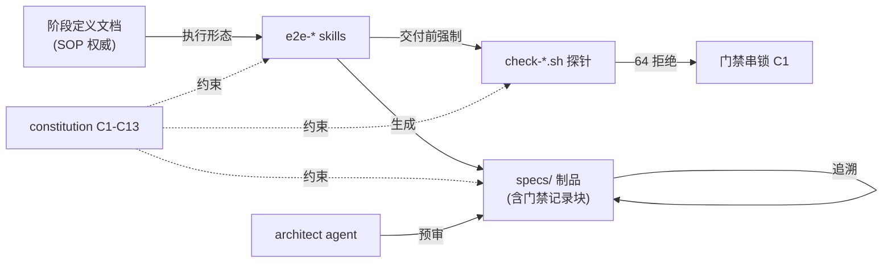

# Architecture Spine（as-is 主干）

> ≤300 行纪律 · 2026-07-31 · 只记真实现状；理想态在 ADR proposed。随 PR 演进。

## 系统边界

当前形态：**AISEP729 工作区 = 平台仓种子**（尚未 git init——M1 第一件事）。未来拆分：平台仓（本目录演进）+ demo 业务仓（赌场输赢记录，M3 新建）。运行环境：仅 macOS 实测（NFR-1）。

## 组件清单（现有）

```text
AISEP729/
├── docs/
│   ├── constitution.md            # 工程宪法 C1-C13（本阶段新立）
│   ├── glossary.md                # 名词权威（全局+阶段0/1/2 词条）
│   ├── architecture/{spine.md, adr/}   # 本文件 + 决策记录
│   └── process/stages/stage-{0,1,2}-*.md   # 阶段定义（SOP 权威）
├── specs/platform-pilot/          # 产物状态机工作区：prfaq(⓪go) prd(①批准) stories spec plan
├── .claude/
│   ├── skills/e2e-{discovery,requirements,design}/   # 每个=SKILL.md+templates/+scripts/
│   └── agents/architect.md        # 预审 subagent（只读五查）
├── E2E研发平台-全局视图.html       # 宏观可视化（四层/六段/里程碑）
└── *-完整报告.{md,html,pdf,m4a}   # 两份 /survey 调研（设计证据链）
```

## 关键结构关系



## 关键约束（设计已定，ADR 留痕）

| 约束 | 出处 |
|---|---|
| 四层架构：真相层(docs/specs)≠适配层(.claude) | ADR-001/002，宪法 C4 |
| hooks=本地快反馈，硬门禁在服务端 | ADR-003，宪法 C3 |
| 门禁账本=制品内文本块（严格格式） | ADR-004 |
| 探针=bash（macOS 自带零依赖） | ADR-005 |
| 个人 skills → vendored 复制改造 | ADR-006，宪法 C9 |
| 仅 macOS 实测（BSD 工具语法可用） | ADR-007 |
| 阶段六件套定式（定义=权威/skill=执行/探针=验收） | ADR-008 |

## 已知债务（如实记录）

- 未 git init：无版本历史/无法 PR 演进——M1 首任务
- 探针无负样本测试（违宪法 C13）——M1 落 `tests/probe-negative/`
- 三个 skill 的门禁校验各自 grep，格式函数未抽公共库——M1 抽 `scripts/lib/gate.sh`
- CI 双环未接（依赖远程仓，移交-M3）
