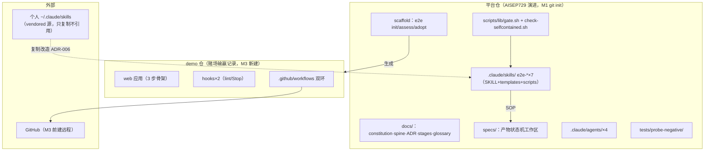

# PLAN：platform-pilot（技术方案）

> 阶段 2 产物 · 门禁②评审材料 · 2026-07-31 · 门禁②记录见 spec.md 尾部（三制品共用）

## 结构（C4 Container 级）

## 技术选型

| 选择 | 内容 | 依据 |
|---|---|---|
| 制品格式 | Markdown + 尾部门禁文本块 | ADR-004 |
| 探针 | bash（BSD 语法可用） | ADR-005/007 |
| 图 | Mermaid 即代码 | 调研（架构即代码，随 PR 演进） |
| 分发 | plugin + 本地 marketplace（M2/M4） | ADR-001 L3；官方机制 |
| CI | GitHub Actions，runner 钉 `macos-latest` | ADR-007 选项 B 护栏 |
| 脚手架形态 | bash 脚本 `e2e`（子命令 init/assess/adopt） | ADR-005 同族；免 node/python 依赖 |
| lint（demo 仓） | 按 demo 技术栈定（web 小工具→eslint/prettier 或纯 html 用 tidy）——M3 定 | 移交 tasks |

## 质量场景（ATAM，每条 NFR 一场景）

| NFR | 刺激 | 期望响应与度量 | 设计应对 | 牺牲了什么（权衡点） |
|---|---|---|---|---|
| NFR-1 仅 macOS | 受众在 Linux CI 跑脚本 | 明确失败信息而非静默错行为 | CI 钉 macos runner；手册高危写法清单 | Linux 受众即刻可用性；macos runner 计费较高 |
| NFR-2 中文 | 受众打开任一制品/skill 输出 | 100% 中文可读 | 模板中文单源；评审抽查 | 国际开源传播（二期英文） |
| NFR-3 版本基线 | Claude Code 发新版行为变化 | 手册可查实测基线版本 | 手册版本字段+M4 实测记录；plugin 锁版本 | 不追新特性（Agent Teams 等 experimental 已 Won't） |
| NFR-4 自包含 | 干净机器 clone 平台仓 | 全流程可跑，探针零命中个人路径 | SPEC-17 探针 M1 起常跑 | 与个人版分叉的双向搬运成本（ADR-006） |
| NFR-5 制品纪律 | 制品膨胀/缺门禁块 | 探针 FAIL 拒绝交付 | SPEC-1~3/6~8 + 负样本测试 | 写作自由度（模板即镣铐，接受） |
| NFR-6 托管演进 | M3 需要 CI 双环 | M3 入口前远程仓就位 | M1-M2 本地 git；M3 入口检查清单第一项=建远程 | 前期无异地备份（本地 Time Machine 兜底，试点接受） |

## Non-goals（设计级排除，承 PRD Won't 再加码）

- 不做 gates.yaml 结构化账本（ADR-004，复议条件明确）
- 不做跨 feature 门禁看板（demo 已定为赌场记录；复议随 ADR-004）
- 不做 skill 公共包抽象（ADR-006 选项 C 否决）
- 不做 GNU/BSD 双兼容层（ADR-007；仅高危写法清单）
- 不引入任何需安装的运行时/包管理（零依赖原则，ADR-005）

## 风险与 spike（时间盒，异构评审#9 重排：最险的最先拆）

| 风险/未知 | spike 任务（进 tasks） | 时间盒 | 排期 | 失败即触发 |
|---|---|---|---|---|
| ~~claude-code-action 在私有仓的配置/计费/权限未实测~~ **已拆（T-1）** | S1 ✅ **结论**：质量门禁 workflow 实测通过（macos-latest/13s/四阶段探针全绿，run 30583711579）；AI 评审改用 `claude -p --bare` headless（ADR-013：可复现+结构化判定+无第三方依赖），但认证绕不开（bare 跳过 OAuth，须 API key）→ **按预定降级**：外环纯质量门禁，AI 评审留内环；headless workflow 已写成模板待凭据启用 | 半天 | ✅ M1 首日已完成 | 已触发降级并记 ADR-013 |
| ~~ratchet violation identity 稳定性~~ **已拆（T-3）** | S5 ✅ **结论**：身份=`工具:规则:文件:内容md5前8位`（**不含行号**→漂移不误报）；判定=`comm -13` 集合差（**非数量比较**→"替换违规总数不变"可抓）；linter 无关适配器（`RATCHET_LINTER` 可换）。六用例负样本全绿，过程中抓出 2 个真缺陷 | 半天 | ✅ M1 已完成 | 未触发降级（方案成立，无需退化粒度） |
| 风险路由与分支保护组合行为（CODEOWNERS/approver≠author） | **S6：测试仓配置分支保护+高低风险两类 PR 路由实测** | 半天 | **M1-M2 之交** | 路由降级为"高风险全量人审"（不做路径细分）——记 ADR |
| Stop hook 在 headless/CI 场景行为未知 | S3：headless `claude -p` 下验证 Stop/PostToolUse 是否触发 | 半天 | M2 | hooks 定位收窄为"交互会话专用"，CI 侧全靠 required checks（ADR-003 已兼容） |
| ~~churn×complexity 体检在浅历史仓退化~~ **已拆（M2-C）** | S4 ✅ **结论**：阈值定为 **<20 commits 或 shallow clone 即降级**；降级后改报「规模清单（非空行数 Top20）」并**显式标注 ⚠️ 历史不足、大文件≠高风险**，避免拿不可信 churn 当依据。实测 4-commit 仓正确触发降级 | 2 小时 | ✅ M2-C 完成 | 降级即方案，已实现 |
| plugin 本地 marketplace 安装路径未实测 | S2：e2e-discovery 打 plugin 从本地 marketplace 装进测试项目（Should 项，**后置**） | 半天 | M4 | US-11 降级为"目录拷贝+文档说明"——记 ADR |

## Fitness Functions（M3 落 CI 的架构断言）

**平台仓自审**：

| 断言 | 检查方式 |
|---|---|
| spine.md ≤300 行 | check-design.sh（`--final` 下 FAIL） |
| 每个 ADR 备选 ≥2 且有后果段、编号连续 | check-design.sh |
| 平台仓零个人路径 | check-selfcontained.sh（M1） |
| 每探针有负样本且全绿 | tests/probe-negative/run.sh（M1） |
| .claude/ 下无业务真相文件 | 目录白名单探针（M1，宪法 C4） |
| 每 skill 六件套结构完整（manifest 驱动） | SPEC-18 结构探针（M1） |
| 制品无未决占位符（final 模式） | check-*.sh `--final`（M1 增强） |

**业务仓示范断言**（demo 仓落地，US-13 承接——异构评审#1 修复）：

| 断言 | 检查方式 |
|---|---|
| 依赖方向：UI 层不得直接 import 存储层 | grep 断言入 demo CI（M3，随 demo 栈定具体规则） |
| 模块大小：单文件 ≤400 行 | wc 探针入 demo CI（M3） |
| ratchet 基线只降不升 | SPEC-14（M3） |

## 里程碑映射（异构评审#9：纵向骨架优先 + 小时预算 + 砍线）

> 度量=复杂度点（ADR-012，非人类工时）。熔断信号=返工次数（验证连续失败 3 次）与 spike 超时间盒，非点数上限。日历约束仍是一个月（prfaq appetite）。

| 里程碑 | 内容 | 复杂度点 | 砍线（熔断触发时先砍） |
|---|---|---|---|
| **M1 纵向骨架**（第 1 周） | git init + **S1 首日**（测试私有仓 CI 冒烟）+ gate.sh 公共库 + init 最小版 + 探针增强（--final/占位检测）+ 负样本测试 + 自包含探针 + S5 | 38 | assess/adopt 全部推 M2；init 只出目录树不出引导语 |
| **M2 能力层**（第 2 周） | implement/review/release/retire 四 skill + assess/adopt + vendored 改造 + S3/S4/S6 + check-tasks/review/release/retire 探针 | ~35 | retire skill 降为模板+手册说明；assess 口径砍到热点清单单项 |
| **M3 全链路**（第 3 周） | demo 仓（赌场输赢记录）走六门禁 + CI 双环三类负样本 + ratchet 实测 + fitness fn 入 CI + 企业模式投影校验 | ~30 | 企业模式投影校验降级为手册文档化；demo 骨架 3 步砍到 2 步（记一笔+看流水） |
| **M4 交付**（第 4 周） | 手册（SPEC-24 smoke）+ 视频（SPEC-25）+ S2 marketplace + 自举留痕补全 | ~15 | S2/US-11 砍（Kano 惊喜型）；视频降精度（一镜到底） |
